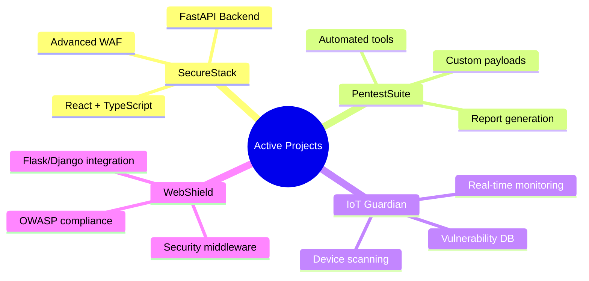

<div align="center">
  
# Hello, I'm Scroll! 👨‍💻
## Cybersecurity Expert | Full-Stack Developer | Security Researcher | Ethical Hacker

[](https://t.me/scroll_be)
[](https://github.com/scrollDynasty)
[](https://www.instagram.com/scroll_privacy/)

### "Security is not a product, but a process" 🛡️
### "Code with purpose, secure with precision" 💻

</div>

## 🎯 About Me

Hey there, welcome to my digital realm! I'm a dedicated cybersecurity specialist and full-stack developer with extensive experience in penetration testing, vulnerability assessment, and modern web development. My mission is to make the digital world safer by identifying vulnerabilities before malicious actors can exploit them, while building secure and scalable applications.

```ascii
🔐 Professional Stats:
┌──────────────────┬─────────────────┬──────────────────┐
│ Vulnerabilities  │ 500+ discovered │ Apps Developed   │
│ CTFs Completed   │ 200+ challenges │ Security Tools   │
│ Projects Led     │ 50+ pentests    │ Research Papers  │
│ Bug Bounties     │ $50K+ earned    │ Code Commits     │
└──────────────────┴─────────────────┴──────────────────┘
      │ 75+ apps built │   25+ tools    │   15+ published  │
      │ 5K+ commits    │                │                  │
```

### My Philosophy 🎯
- **Security-First Development**: Building applications with security as a core principle
- **Full-Spectrum Testing**: Leveraging both automated tools and manual testing for maximum effectiveness
- **Continuous Innovation**: Always staying updated with the latest attack techniques and modern frameworks
- **Ethical Excellence**: Following responsible disclosure principles and clean code practices
- **Knowledge Sharing**: Actively contributing to the community through open-source projects and research

## 💻 Technology Stack

### Frontend Development
<div align="center">


</div>

### UI/UX Frameworks & Libraries
<div align="center">


</div>

### Backend Development
<div align="center">


</div>

### Programming Languages & Core Technologies
<div align="center">


</div>

### Database & DevOps
<div align="center">


</div>

## 🛡️ Cybersecurity Arsenal

### Penetration Testing Tools
```ascii
Expertise Level:
⭐ Beginner  ⭐⭐ Intermediate  ⭐⭐⭐ Advanced  ⭐⭐⭐⭐ Expert  ⭐⭐⭐⭐⭐ Master

🔨 Metasploit     ⭐⭐⭐⭐⭐  │  🌐 Burp Suite     ⭐⭐⭐⭐⭐
🔍 Nmap           ⭐⭐⭐⭐⭐  │  💉 SQLmap         ⭐⭐⭐⭐⭐
📡 Wireshark      ⭐⭐⭐⭐   │  🔑 Hydra          ⭐⭐⭐⭐
🛡️ John the Ripper ⭐⭐⭐⭐   │  📶 Aircrack-ng    ⭐⭐⭐⭐
🔓 OWASP ZAP      ⭐⭐⭐⭐   │  🎯 Cobalt Strike  ⭐⭐⭐⭐
```

### Areas of Expertise 💡
- 🔐 **Web & Mobile Application Security**: Full-stack penetration testing with modern frameworks
- 🌐 **Network Infrastructure Security**: Advanced network reconnaissance and exploitation
- 🛡️ **Secure Code Review**: Static and dynamic analysis of modern applications
- 🔬 **Malware Analysis & Reverse Engineering**: Advanced threat analysis and detection
- 📱 **IoT & Embedded Systems**: Security assessment of connected devices
- ☁️ **Cloud Security**: AWS, Azure, GCP security auditing and configuration review

## 🌟 Professional Achievements

```ascii
🏆 Hack The Box     │ 🎯 TryHackMe      │ 🔍 Shodan         │ 🦠 VirusTotal
────────────────────┼───────────────────┼──────────────────┼───────────────
Pro Hacker          │ Top 1%            │ Active Hunter     │ Power User
Global Rank: #42     │ 350+ rooms        │ IoT Specialist    │ Malware Expert
HTB Certified       │ King of the Hill  │ Threat Intel      │ Sample Analysis
```

### Bug Bounty & Recognition 🏅
```ascii
Platform          Rank        Bounties    Total Earned
──────────────────────────────────────────────────────
HackerOne         Top 100     45+ bugs    $32,000+
Bugcrowd          Elite       38+ vulns   $18,500+
Private Programs  VIP         67+ issues  $25,000+
──────────────────────────────────────────────────────
Total Impact: 150+ vulnerabilities | $75,500+ earned
```

## 🚀 Development & Security Projects

### Featured Projects 2025 ⭐


### Open Source Contributions 🔧
- **SecureReact** - React security component library with TypeScript
- **FastAPI-Security** - Advanced security middleware for FastAPI
- **VulnScanner** - Automated web application vulnerability scanner
- **TypeScript-Pentesting** - Modern pentesting tools written in TypeScript
- **Django-SecureAuth** - Enhanced authentication system for Django

## 💫 Skills Matrix

```ascii
Development Skills              Security Skills              Progress
━━━━━━━━━━━━━━━━━━━━━━━━━━━━━    ━━━━━━━━━━━━━━━━━━━━━━━━━━━━━    ━━━━━━━━━━
React/TypeScript               [██████████] 100%    Web Pentesting           [█████████░] 95%
FastAPI/Django                 [█████████░] 90%     Network Security         [████████░░] 85%
Full-Stack Development         [█████████░] 90%     Malware Analysis         [███████░░░] 75%
UI/UX Design                   [████████░░] 80%     Mobile App Security      [████████░░] 80%
Cloud Architecture             [███████░░░] 70%     Cloud Security           [██████░░░░] 65%
DevOps & CI/CD                 [███████░░░] 70%     Reverse Engineering      [███████░░░] 75%
```

## 🎓 Certifications & Education

### Security Certifications 🏅
- 🔒 **OSCP** (Offensive Security Certified Professional) - 2024
- 🛡️ **OSWE** (Offensive Security Web Expert) - 2024
- ⚡ **CEH** (Certified Ethical Hacker) - Master Level
- 🎯 **eJPT** (eLearnSecurity Junior Penetration Tester)
- 🔐 **CompTIA Security+** - Advanced
- 📡 **OSWP** (Offensive Security Wireless Professional)

### Development Certifications 💻
- ⚛️ **React Professional Developer** - Meta Certified
- 🏗️ **AWS Solutions Architect** - Associate
- 🐍 **Python Institute PCAP** - Certified Associate
- 📊 **TypeScript Expert** - Microsoft Certified

## 📚 Research & Publications

### Latest Publications 📖
1. **"Securing Modern React Applications: A TypeScript Approach"** (2025)
   - Advanced security patterns in React
   - TypeScript security best practices
   - Real-world implementation examples

2. **"FastAPI Security: From Development to Production"** (2024)
   - Security middleware development
   - Authentication and authorization
   - Production deployment strategies

3. **"Advanced WAF Bypass Techniques in Modern Web Apps"** (2024)
   - Modern WAF analysis and evasion
   - Framework-specific bypass methods
   - Defense recommendations

4. **"IoT Security: Comprehensive Testing Methodology"** (2024)
   - Smart device security assessment
   - Automated testing frameworks
   - Threat modeling approaches

### Speaking Engagements 🎤
- **DEF CON 32** - "Breaking Modern Web Applications"
- **Black Hat USA 2024** - "IoT Security Arsenal"
- **BSides SF** - "Secure Development with TypeScript"
- **OWASP Global AppSec** - "FastAPI Security Patterns"

## 🎯 2025 Goals & Roadmap

```ascii
Development Goals               Security Goals                Progress
━━━━━━━━━━━━━━━━━━━━━━━━━━━━━    ━━━━━━━━━━━━━━━━━━━━━━━━━━━━━    ━━━━━━━━━━
Master Rust Development        [██████░░░░] 60%     OSEE Certification          [████░░░░░░] 40%
Contribute to Next.js          [███░░░░░░░] 30%     Zero-Day Research           [██░░░░░░░░] 20%
Launch SaaS Platform           [████████░░] 80%     Conference Keynotes         [██████░░░░] 60%
Open Source Maintainer        [██████░░░░] 60%     Security Tool Suite         [████████░░] 80%
```

### Upcoming Projects 🚧
- **SecureStack Pro** - Enterprise security platform (React + TypeScript + FastAPI)
- **VulnDB API** - Comprehensive vulnerability database with GraphQL
- **PenTest Automation Suite** - AI-powered penetration testing toolkit
- **React Security Kit** - Advanced security components library

## 📊 GitHub Analytics

<div align="center">


</div>

## ⚠️ Legal Disclaimer

```text
🔒 SECURITY & LEGAL NOTICE

All materials, tools, and research in this repository are intended for:
✅ Educational purposes only
✅ Authorized security testing with explicit permission
✅ Improving cybersecurity awareness and defense

The author is NOT responsible for any misuse of the provided information.

⚖️ COMPLIANCE REQUIREMENTS:
• Use only on systems where you have explicit written permission
• Always comply with your country's laws and ethical standards
• Follow responsible disclosure principles for any vulnerabilities found
• Respect privacy and data protection regulations

🛡️ ETHICAL GUIDELINES:
• Security research should benefit the community
• Always prioritize defense over offense
• Contribute to making the internet safer for everyone
```

## 📬 Let's Connect & Collaborate!

<div align="center">

### 🚀 Building a Secure Digital Future Together! 🚀

[](https://t.me/scroll_be)
[](https://www.instagram.com/scroll_privacy/)
[](#)
[](#)

#### 💼 Available for:
- 🔒 **Security Consulting** & Penetration Testing
- 💻 **Full-Stack Development** Projects
- 🎤 **Speaking Engagements** & Workshops
- 🤝 **Open Source Collaboration**
- 📚 **Technical Writing** & Research

#### 📧 Business Inquiries: [scroll@proton.me](mailto:scroll@proton.me)

</div>

---

<div align="center">

### 🔐 "In code we trust, in security we verify" 🔐
### 💻 "Every line of code is a step towards digital excellence" 💻


</div>
