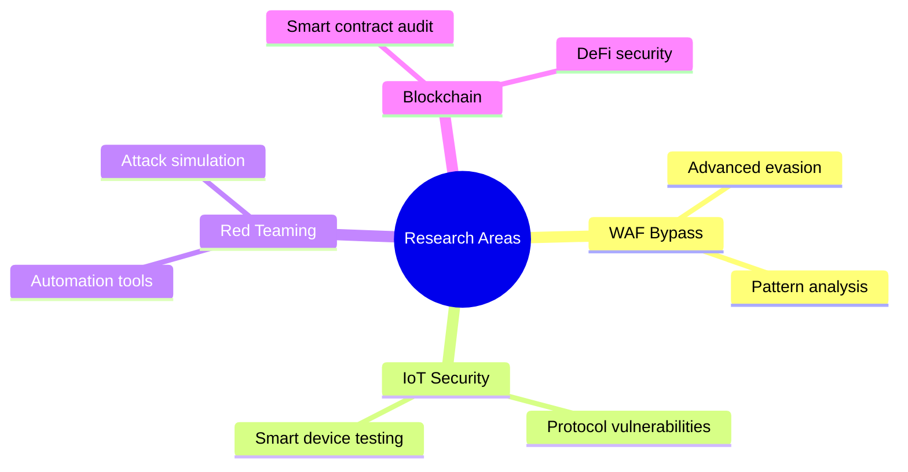

<div align="center">
  
# Hello, I'm Scroll! 👨‍💻
## Cybersecurity Expert | Security Researcher | Ethical Hacker

[](https://t.me/scroll_be)
[](https://github.com/scrollDynasty)
[](https://www.instagram.com/scroll_privacy/)

### "Security is not a product, but a process" 🛡️
</div>

## 🎯 About Me

Hey there, welcome to my digital realm! I'm a dedicated cybersecurity specialist with extensive experience in penetration testing and vulnerability assessment. My mission is to make the digital world safer by identifying vulnerabilities before malicious actors can exploit them.

```ascii
🔐 Key Stats:
┌──────────────────┬─────────────────┐
│ Vulnerabilities  │ 500+ discovered │
│ CTFs Completed   │ 200+           │
│ Projects Led     │ 50+            │
│ Tools Developed  │ 25+            │
└──────────────────┴─────────────────┘
```

### My Approach 🎯
- **Full-Spectrum Testing**: Leveraging both automated tools and manual testing for maximum effectiveness
- **Continuous Learning**: Always staying updated with the latest attack techniques and defense methods
- **Ethical Hacking**: Following responsible disclosure principles
- **Knowledge Sharing**: Actively contributing to the community through blogs and talks

### Areas of Expertise 💡
- 🔐 Web and Mobile Application Penetration Testing
- 🌐 Network Infrastructure Security Auditing
- 🛡️ Wireless Network Security Assessment
- 🔬 Malware Analysis and Reverse Engineering
- 📱 IoT Security and Embedded Systems Testing

## 💪 Technical Arsenal

### Programming Languages & Technologies
<div align="center">

 


</div>

### Daily Weapons 🛠️
```ascii
Expertise Level:
⭐ Beginner  ⭐⭐ Intermediate  ⭐⭐⭐ Advanced  ⭐⭐⭐⭐ Expert  ⭐⭐⭐⭐⭐ Master

🔨 Metasploit     ⭐⭐⭐⭐⭐  │  🌐 Burp Suite     ⭐⭐⭐⭐⭐
🔍 Nmap           ⭐⭐⭐⭐⭐  │  💉 SQLmap         ⭐⭐⭐⭐
📡 Wireshark      ⭐⭐⭐⭐   │  🔑 Hydra          ⭐⭐⭐⭐
🛡️ John the Ripper ⭐⭐⭐⭐   │  📶 Aircrack-ng    ⭐⭐⭐⭐
```

## 🌟 Achievements & Platforms

```ascii
🏆 Hack The Box    │ 🎯 TryHackMe     │ 🔍 Shodan        │ 🦠 VirusTotal
───────────────────┼──────────────────┼─────────────────┼──────────────
Pro Hacker         │ Top 1%           │ Active Hunter    │ Power User
Top 100 Global     │ 300+ rooms       │ Threat Monitor   │ Malware Analysis
```

## 🚀 Current Research Focus

### Active Projects 2025


## 💫 Skills Matrix

```ascii
Technical Skills                Progress
━━━━━━━━━━━━━━━━━━━━━━━━━━━━━━━━━━━━━━━
Web Penetration Testing        [█████████░] 90%
Network Security              [████████░░] 80%
Malware Analysis              [███████░░░] 70%
Mobile App Security           [████████░░] 80%
Cloud Security               [██████░░░░] 60%
```

## 🎓 Certifications
- 🏅 OSCP (Offensive Security Certified Professional)
- 🏅 CEH (Certified Ethical Hacker)
- 🏅 eJPT (eLearnSecurity Junior Penetration Tester)
- 🏅 CompTIA Security+
- 🏅 OSWP (Offensive Security Wireless Professional)

## 📚 Recent Publications & Research

### Latest Findings 📖
1. **"Advanced WAF Bypass Techniques"**
   - Modern WAF analysis
   - Bypass methodologies
   - Defense recommendations

2. **"IoT Security: From Theory to Practice"**
   - Smart device vulnerabilities
   - Real-world examples
   - Testing methodology

3. **"Automating Pentesting with Python"**
   - Custom tool development
   - Best practices
   - Code examples

## 🎯 2025 Goals

```ascii
Professional Goals                Progress
━━━━━━━━━━━━━━━━━━━━━━━━━━━━━━━━━━━━━━━
OSWE Certification              [██░░░░░░░░] 20%
Research Publications           [███░░░░░░░] 30%
Conference Talks               [████░░░░░░] 40%
New Security Tools             [██████░░░░] 60%
```

## ⚠️ Legal Disclaimer

```text
All materials in this repository are intended for educational purposes only. 
The author is not responsible for any misuse of the provided information. 
Use this knowledge ethically and legally.

Tools and methods described here should only be used on systems where you 
have explicit permission for testing. Always comply with your country's 
laws and ethical standards.
```

## 📬 Let's Connect!

<div align="center">

### Building a Secure Digital Future Together! 🚀

[](https://t.me/scroll_be)
[](https://www.instagram.com/scroll_privacy/)

#### 💬 Open for Collaboration and Interesting Projects

</div>

---

<div align="center">
<h3>🔐 Let's Make the Internet Safer Together! 🔐</h3>
</div>
